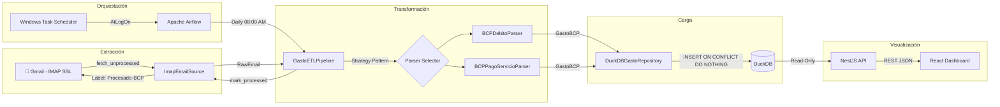

<div align="center">

# 💳 Gastos ETL

**Pipeline automatizado de Data Engineering que extrae notificaciones bancarias de Gmail,
transforma y persiste los datos en DuckDB, y los visualiza en un dashboard analítico en tiempo real.**

`Python 3.11+` · `DuckDB` · `Apache Airflow` · `NestJS 11` · `React 19` · `Podman` · `pytest`

*Pipeline end-to-end: desde el correo bancario hasta el gráfico interactivo, sin intervención manual.*

</div>

---

## 📋 Tabla de Contenido

- [Descripción del Proyecto](#-descripción-del-proyecto)
- [Arquitectura](#-arquitectura)
- [Flujo de Datos (End-to-End)](#-flujo-de-datos-end-to-end)
- [Tech Stack](#-tech-stack)
- [Patrones de Diseño y Buenas Prácticas](#-patrones-de-diseño-y-buenas-prácticas)
- [Estructura del Proyecto](#-estructura-del-proyecto)
- [Quickstart](#-quickstart)
- [Dashboard Analítico](#-dashboard-analítico)
- [Orquestación con Airflow](#-orquestación-con-airflow)
- [Testing](#-testing)
- [Consultas Ad-Hoc](#-consultas-ad-hoc)

---

## 🎯 Descripción del Proyecto

**Problema:** Los bancos peruanos (BCP) envían notificaciones de consumo por email, pero no ofrecen una API ni exportación estructurada de gastos para tarjetas de débito. Hacer seguimiento manual de gastos es tedioso y propenso a errores.

**Solución:** Un pipeline ETL completamente automatizado que:

1. **Extrae** correos de notificación de consumo y pagos de servicio del BCP desde Gmail via IMAP + App Password (sin costos de Google Cloud ni OAuth complejo).
2. **Transforma** el HTML de cada email en registros estructurados usando parsers especializados con regex resiliente y BeautifulSoup.
3. **Carga** los datos en DuckDB — una base analítica embebida, sin servidor, optimizada para OLAP.
4. **Visualiza** mediante un dashboard React con gráficos interactivos servidos por una API NestJS.
5. **Orquesta** la ejecución diaria automática con Apache Airflow en un contenedor Podman, con auto-arranque al encender la PC.

> **Cero costos de infraestructura cloud.** Todo corre en la máquina local del usuario con automatización completa.

---

## 🏗 Arquitectura



### Capas del Sistema

| Capa | Componente | Responsabilidad |
|:-----|:-----------|:----------------|
| **Source** | `ImapEmailSource` | Conexión IMAP SSL, búsqueda incremental, checkpoint, etiquetado Gmail |
| **Parser** | `BCPDebitoParser`, `BCPPagoServicioParser` | Extracción de monto, comercio, fecha desde HTML bancario |
| **Pipeline** | `GastoETLPipeline` | Orquestación E→T→L con tolerancia a fallos por item |
| **Repository** | `DuckDBGastoRepository` | Persistencia idempotente con migraciones automáticas |
| **API** | NestJS `GastosController` + `GastosService` | REST endpoints analíticos (read-only sobre DuckDB) |
| **Dashboard** | React + Recharts + Tailwind CSS | Visualización interactiva con filtros y paginación |
| **Scheduler** | Airflow DAG + Podman + Windows Task Scheduler | Ejecución diaria automatizada con auto-arranque |

---

## 🔄 Flujo de Datos (End-to-End)

```
1. 📧 Gmail recibe notificación del BCP ("Realizaste un consumo" / "Pago de servicio")
          ↓
2. ⏰ Airflow dispara el DAG a las 08:00 AM (hora Perú) ─ o ejecución manual
          ↓
3. 📅 Se lee checkpoint.json → calcula ventana temporal desde última corrida exitosa
          ↓
4. 📥 ImapEmailSource conecta via IMAP SSL → busca emails no procesados desde checkpoint
          ↓
5. 🔍 Pipeline verifica duplicados: repository.exists(message_id)
          ↓
6. 🔀 Strategy Pattern: itera parsers hasta encontrar uno que haga match (can_parse)
          ↓
7. 🧹 Parser seleccionado: BeautifulSoup strip HTML → regex lookahead por labels
       → extrae monto (Decimal), comercio, fecha, tipo
          ↓
8. 💾 DuckDBGastoRepository: INSERT ... ON CONFLICT (message_id) DO NOTHING
          ↓
9. 🏷️ Email taggeado con label "Procesado-BCP" en Gmail (auditable desde la UI)
          ↓
10. ✅ Checkpoint actualizado → email de confirmación via Airflow SMTP
          ↓
11. 📊 API NestJS lee DuckDB (read-only) → Dashboard React renderiza gráficos
```

---

## 🛠 Tech Stack

### ETL Pipeline (Python)

| Tecnología | Uso |
|:-----------|:----|
| **Python 3.11+** | Lenguaje principal del pipeline |
| **DuckDB ≥ 1.0** | Base de datos analítica embebida (sin servidor) |
| **Pydantic V2** | Validación de modelos de dominio y configuración tipada |
| **BeautifulSoup4** | Parsing resiliente de HTML bancario |
| **Tenacity** | Reintentos con backoff exponencial en conexiones IMAP |
| **python-dotenv** | Gestión de variables de entorno (`.env`) |

### Orquestación

| Tecnología | Uso |
|:-----------|:----|
| **Apache Airflow 2.9** | Scheduling, reintentos, alertas por email |
| **Podman** | Contenedorización rootless (alternativa a Docker) |
| **Windows Task Scheduler** | Auto-arranque del contenedor al iniciar sesión |

### Dashboard & API (TypeScript)

| Tecnología | Uso |
|:-----------|:----|
| **NestJS 11** | API REST con inyección de dependencias |
| **React 19** | Frontend SPA con hooks y composición |
| **Vite 8** | Build tool y dev server con HMR |
| **Tailwind CSS 4** | Estilizado utility-first con soporte dark mode |
| **Recharts 3** | Gráficos interactivos (barras apiladas, barras horizontales) |
| **DuckDB Node.js** | Driver nativo para queries analíticas |

---

## 🧩 Patrones de Diseño y Buenas Prácticas

### Principios de Ingeniería

| Patrón / Práctica | Implementación |
|:-------------------|:---------------|
| **Clean Architecture & DIP** | El pipeline depende de `Protocol` interfaces (`EmailSource`, `EmailParser`, `GastoRepository`), no de implementaciones concretas |
| **Strategy Pattern** | Múltiples parsers (`BCPDebitoParser`, `BCPPagoServicioParser`) evaluados dinámicamente via `can_parse()` — extensible sin modificar el pipeline |
| **Repository Pattern** | Persistencia abstraída en `GastoRepository`, implementada por `DuckDBGastoRepository` |
| **Idempotencia** | Deduplicación doble: `exists(message_id)` pre-check + `ON CONFLICT DO NOTHING` en SQL |
| **Tolerancia a Fallos** | Error en un email → se loguea y continúa con el resto del batch (no rompe la corrida) |
| **Privacy by Design** | Datos de tarjeta (número, últimos dígitos) **deliberadamente excluidos** del modelo de datos |
| **12-Factor Config** | Variables de entorno + Pydantic Settings + `.env.example` como template |
| **Checkpoint Incremental** | Solo procesa emails nuevos desde la última corrida exitosa — resiliente a días sin PC |
| **Migraciones Idempotentes** | Schema DDL auto-ejecutado al instanciar el repositorio (sin Alembic) |
| **IaC Testing Guards** | Tests que validan sincronización entre `docker-compose.yaml`, scripts PowerShell, y DAG |

### Concurrencia DuckDB (API)

La API NestJS usa **conexiones efímeras** (abre y cierra DuckDB por query) en modo `READ_ONLY`. Esto evita locks de archivo que bloquearían al pipeline ETL de Airflow al escribir. Patrón diseñado para coexistencia segura escritor Python + lector Node.js.

---

## 📁 Estructura del Proyecto

```
gastos-etl/
├── src/gastos_etl/              # 🐍 Core ETL Package
│   ├── config.py                #    Pydantic Settings (12-Factor)
│   ├── exceptions.py            #    Jerarquía de excepciones de dominio
│   ├── models.py                #    Modelos Pydantic: RawEmail, GastoBCP
│   ├── pipeline.py              #    Orquestador ETL (Strategy + fault-tolerant)
│   ├── sources/
│   │   ├── base.py              #    Protocol: EmailSource
│   │   └── imap_source.py       #    Implementación IMAP SSL + Gmail labels
│   ├── parsers/
│   │   ├── base.py              #    Protocol: EmailParser
│   │   ├── bcp_debito_parser.py #    Parser consumos tarjeta débito/crédito
│   │   └── bcp_pago_servicio_parser.py  # Parser pagos de servicios
│   └── repositories/
│       ├── base.py              #    Protocol: GastoRepository
│       └── duckdb_repository.py #    DuckDB con migraciones automáticas
│
├── dags/
│   └── gastos_bcp_dag.py        # ⏰ Airflow DAG (08:00 AM Lima, alertas SMTP)
│
├── api/                         # 🌐 NestJS REST API
│   └── src/
│       ├── main.ts              #    Entry point (CORS, global prefix)
│       └── gastos/
│           ├── gastos.module.ts #    Módulo NestJS
│           ├── gastos.controller.ts  # 4 endpoints REST
│           ├── gastos.service.ts     # Queries analíticas SQL
│           └── duckdb.service.ts     # Driver DuckDB (ephemeral connections)
│
├── dashboard/                   # 📊 React Dashboard
│   └── src/
│       ├── App.tsx              #    Layout principal + data fetching
│       ├── api.ts               #    Cliente API + formatters
│       └── components/
│           ├── StatTile.tsx     #    KPI cards con delta %
│           ├── MonthlyChart.tsx #    Gráfico barras apiladas mensual
│           ├── TopComerciosChart.tsx  # Top comercios (barra horizontal)
│           └── MovimientosTable.tsx   # Tabla paginada con filtros
│
├── scripts/
│   ├── init_db.py               # Inicializa schema DuckDB
│   ├── run_local.py             # Runner local (sin Airflow)
│   ├── query_gastos.py          # CLI para consultas ad-hoc
│   ├── start_airflow.ps1        # Arranque idempotente del contenedor
│   └── register_autostart_task.ps1   # Registro en Windows Task Scheduler
│
├── tests/
│   ├── test_parser.py           # Tests parser débito (con .eml real)
│   ├── test_pago_servicio_parser.py  # Tests parser pago servicio
│   ├── test_pipeline.py         # Tests pipeline con fakes/mocks
│   ├── test_deploy_config.py    # Tests de sincronización de config
│   └── fixtures/                # Emails de prueba (.eml, .html)
│
├── data/
│   ├── gastos.duckdb            # 🗄️ Base de datos analítica
│   └── checkpoint.json          # Timestamp última corrida exitosa
│
├── Dockerfile.airflow           # Imagen Airflow (Python 3.11)
├── docker-compose.airflow.yaml  # Config de referencia Podman/Docker
├── requirements.txt             # Dependencias Python
├── .env.example                 # Template de variables de entorno
└── .gitignore
```

---

## 🚀 Quickstart

### Prerrequisitos

- **Python 3.11+**
- **Node.js 18+** (para API y Dashboard)
- **Gmail con 2FA activo** + [App Password](https://myaccount.google.com/apppasswords)
- **Podman** (o Docker) — solo para orquestación con Airflow

### 1. Clonar e instalar

```bash
git clone https://github.com/tu-usuario/gastos-etl.git
cd gastos-etl

# Python
python -m venv .venv
.venv\Scripts\Activate.ps1       # Windows PowerShell
pip install -r requirements.txt

# Configuración
cp .env.example .env
# → Edita .env con tu IMAP_USER y IMAP_APP_PASSWORD
```

### 2. Inicializar la base de datos y ejecutar el pipeline

```bash
python scripts/init_db.py        # Crea schema en DuckDB
python scripts/run_local.py      # Ejecuta el pipeline ETL completo
```

El pipeline conecta a Gmail, descarga correos del BCP, los parsea y persiste en `data/gastos.duckdb`. Los emails procesados quedan etiquetados como `Procesado-BCP` en tu Gmail.

### 3. Verificar los datos

```bash
python scripts/query_gastos.py resumen      # Totales por mes
python scripts/query_gastos.py comercios    # Top comercios por gasto
python scripts/query_gastos.py ultimos 20   # Últimos N movimientos
```

---

## 📊 Dashboard Analítico

El dashboard presenta una interfaz completa de análisis financiero personal:

| Componente | Descripción |
|:-----------|:------------|
| **KPI Cards** | Total gastado, número de transacciones, promedio por transacción, variación mes-a-mes (%) |
| **Gráfico Mensual** | Barras apiladas por tipo (consumo vs. pago de servicio) — tendencia de últimos 12 meses |
| **Top Comercios** | Barras horizontales con los comercios donde más se gasta |
| **Tabla de Movimientos** | Tabla paginada con búsqueda por comercio, filtro por tipo, y fechas |

### API Endpoints

| Método | Endpoint | Descripción |
|:-------|:---------|:------------|
| `GET` | `/api/gastos/resumen-general` | KPIs globales: total, conteo, promedio, variación mensual, rango de fechas |
| `GET` | `/api/gastos/resumen-mensual?meses=12` | Desglose mensual agrupado por tipo de transacción |
| `GET` | `/api/gastos/top-comercios?limit=10` | Ranking de comercios por gasto total |
| `GET` | `/api/gastos/movimientos?tipo=&desde=&hasta=&comercio=&page=1&pageSize=25` | Lista paginada con filtros dinámicos |

### Levantar el Dashboard

```bash
# Terminal 1 — API (NestJS)
cd api
cp .env.example .env
npm install
npm run start:dev              # http://localhost:3000

# Terminal 2 — Dashboard (React + Vite)
cd dashboard
npm install
npm run dev                    # http://localhost:5173
```

> El proxy de Vite redirige `/api/*` → `localhost:3000` automáticamente. Para producción, `npm run build` en `dashboard/` genera `dist/` estático que puede servirse desde NestJS via `ServeStaticModule`.

---

## ⏰ Orquestación con Airflow

### Configuración del DAG

| Parámetro | Valor | Justificación |
|:----------|:------|:--------------|
| **Schedule** | `0 8 * * *` | 08:00 AM Lima — la PC personal suele estar encendida a esa hora |
| **Timezone** | `America/Lima` (UTC-5 fijo) | Perú no tiene horario de verano |
| **Catchup** | `False` | Si se pierde un run, el checkpoint trae todo lo pendiente en la siguiente corrida |
| **Retries** | 2 con backoff exponencial (5 min) | Tolerancia a fallos de red temporales |
| **Alertas** | Email SMTP en success, failure y retry | Observabilidad completa del pipeline |

### Despliegue con Podman

```bash
# Construir imagen
podman build -f Dockerfile.airflow -t gastos-etl-airflow:local .

# Ejecutar contenedor
podman run -d --name gastos_etl_airflow \
  --restart unless-stopped \
  --env-file .env \
  -e AIRFLOW__CORE__LOAD_EXAMPLES=false \
  -e PYTHONPATH=/opt/airflow/src \
  -e DUCKDB_PATH=/opt/airflow/data/gastos.duckdb \
  -e CHECKPOINT_PATH=/opt/airflow/data/checkpoint.json \
  -v "$(pwd)/dags:/opt/airflow/dags:Z" \
  -v "$(pwd)/src:/opt/airflow/src:Z" \
  -v "$(pwd)/data:/opt/airflow/data:Z" \
  -v airflow_home:/opt/airflow \
  -p 8080:8080 \
  gastos-etl-airflow:local standalone
```

> **Airflow UI:** http://localhost:8080 — Credenciales en `podman logs -f gastos_etl_airflow` (buscar "Login with username").

### Despausar el DAG (una sola vez)

```bash
podman exec gastos_etl_airflow airflow dags unpause gastos_bcp_etl
```

### Auto-arranque al encender la PC

```powershell
# Registra tarea en Windows Task Scheduler (requiere admin la primera vez)
powershell -ExecutionPolicy Bypass -File scripts\register_autostart_task.ps1

# Verificar
Get-ScheduledTask -TaskName "gastos-etl-airflow-autostart" | Get-ScheduledTaskInfo
```

El script `start_airflow.ps1` es **idempotente**: crea, arranca o no hace nada según el estado del contenedor. Logs en `logs/start_airflow.log`.

**Bug real encontrado y corregido (2026-08-01):** la primera versión de
`start_airflow.ps1` nunca levantaba el contenedor al iniciar sesión, por
dos fallas encadenadas:
1. `podman machine list` devuelve un **array** de líneas en PowerShell, y
   `$array -notmatch "true"` sobre un array no es un booleano — filtra el
   array y devuelve las líneas que NO matchean. La fila de encabezado
   nunca contiene "true", así que ese resultado nunca quedaba vacío y el
   `if` se evaluaba siempre como "la VM no está corriendo", sin importar
   el estado real (se arregló con `-contains` sobre una columna aislada).
2. Al creer que la VM no estaba corriendo, intentaba
   `podman machine start` **sin nombre**, que apunta al nombre por defecto
   `podman-machine-default` — pero la VM real se llama `podmanmachine` —
   y fallaba con `VM does not exist`, abortando el script antes de tocar
   el contenedor.

Se detectó porque el usuario prendió la PC a las 8:05am, se logueó, y el
contenedor seguía parado minutos después. `logs/start_airflow.log` mostró
el error exacto. Ya corregido: el script ahora resuelve el nombre real de
la máquina con `podman machine list --format "{{.Name}}"` y usa
`-contains` para el chequeo de estado, en vez de matchear un array entero
contra un string.

---

## 🧪 Testing

```bash
pytest                           # Ejecuta todo el suite
```

### Estrategia de Testing

| Tipo | Archivo | Qué valida |
|:-----|:--------|:-----------|
| **Unit** | `test_parser.py` | Parser de débito con fixture `.eml` real exportado de Gmail |
| **Unit** | `test_pago_servicio_parser.py` | Parser de pago de servicio con fixture HTML |
| **Integration** | `test_pipeline.py` | Pipeline completo con fakes (`FakeSource`, `FakeParser`, `FakeRepo`) — sin red ni disco |
| **Config Guards** | `test_deploy_config.py` | Sincronización entre `docker-compose.yaml`, scripts PS1, y DAG (nombre contenedor, imagen, schedule, callbacks) |

Los **Config Guards** son particularmente relevantes: previenen drift silencioso entre archivos de infraestructura (ej: renombrar el contenedor en el Compose sin actualizar el PowerShell de arranque).

---

## 🔍 Consultas Ad-Hoc

### CLI incluido

```bash
python scripts/query_gastos.py resumen      # Resumen mensual
python scripts/query_gastos.py comercios    # Top 20 comercios
python scripts/query_gastos.py ultimos 10   # Últimos 10 movimientos
```

### DuckDB directo

```bash
duckdb data/gastos.duckdb
```

```sql
-- Top 5 comercios por gasto total
SELECT comercio, SUM(monto) as total, COUNT(*) as txns
FROM gastos
GROUP BY comercio
ORDER BY total DESC
LIMIT 5;

-- Gasto mensual
SELECT strftime(fecha_consumo, '%Y-%m') as mes, SUM(monto) as total
FROM gastos
GROUP BY mes
ORDER BY mes DESC;
```

### Desde Python

```python
import duckdb

con = duckdb.connect("data/gastos.duckdb", read_only=True)
con.sql("SELECT * FROM gastos ORDER BY fecha_consumo DESC LIMIT 10").show()
```

---

## 📄 Licencia

Proyecto personal de portafolio. Uso libre como referencia.

---

<div align="center">

Hecho con 🧠 por **John** — Data Engineering · Python · Cloud

</div>

