<div align="center">

# 💳 Gastos ETL

**Pipeline automatizado de Data Engineering que extrae notificaciones bancarias de Gmail,
las transforma y las persiste en un modelo estrella en SQL Server para análisis en Power BI.**

`Python 3.11+` · `SQL Server 2022` · `Apache Airflow` · `Podman` · `Power BI` · `pytest`

*Pipeline end-to-end: desde el correo bancario hasta el modelo dimensional listo para BI, sin intervención manual.*

</div>

---

## 📋 Tabla de Contenido

- [Descripción del Proyecto](#-descripción-del-proyecto)
- [Arquitectura](#-arquitectura)
- [Flujo de Datos (End-to-End)](#-flujo-de-datos-end-to-end)
- [Tech Stack](#-tech-stack)
- [Patrones de Diseño y Buenas Prácticas](#-patrones-de-diseño-y-buenas-prácticas)
- [Estructura del Proyecto](#-estructura-del-proyecto)
- [Quickstart](#-quickstart)
- [Modelo Estrella en SQL Server + Power BI](#-modelo-estrella-en-sql-server--power-bi)
- [Dashboard Analítico (congelado)](#-dashboard-analítico-congelado)
- [Orquestación con Airflow](#-orquestación-con-airflow)
- [Testing](#-testing)
- [Consultas Ad-Hoc](#-consultas-ad-hoc)

---

## 🎯 Descripción del Proyecto

**Problema:** Los bancos peruanos (BCP) envían notificaciones de consumo por email, pero no ofrecen una API ni exportación estructurada de gastos para tarjetas de débito. Hacer seguimiento manual de gastos es tedioso y propenso a errores.

**Solución:** Un pipeline ETL completamente automatizado que:

1. **Extrae** correos de notificación de consumo y pagos de servicio del BCP desde Gmail via IMAP + App Password (sin costos de Google Cloud ni OAuth complejo).
2. **Transforma** el HTML de cada email en registros estructurados usando parsers especializados con regex resiliente y BeautifulSoup.
3. **Carga** los datos en DuckDB — una base analítica embebida, sin servidor, optimizada para OLAP.
4. **Visualiza** mediante un dashboard React con gráficos interactivos servidos por una API NestJS.
5. **Orquesta** la ejecución diaria automática con Apache Airflow en un contenedor Podman, con auto-arranque al encender la PC.

> **Cero costos de infraestructura cloud.** Todo corre en la máquina local del usuario con automatización completa.

---

## 🏗 Arquitectura

```mermaid
graph LR
    subgraph Extracción
        A[📧 Gmail - IMAP SSL] -->|fetch_unprocessed| B[ImapEmailSource]
    end

    subgraph Transformación
        B -->|RawEmail| C[GastoETLPipeline]
        C -->|Strategy Pattern| D{Parser Selector}
        D --> E[BCPDebitoParser]
        D --> F[BCPPagoServicioParser]
    end

    subgraph Carga
        E -->|GastoBCP| G[SqlServerGastoRepository]
        F -->|GastoBCP| G
        G -->|get-or-create dims + INSERT WHERE NOT EXISTS| H[(SQL Server<br/>modelo estrella)]
    end

    subgraph "Análisis (Power BI)"
        H -->|Import / DirectQuery| M[Power BI Desktop]
    end

    subgraph "Histórico congelado ❄️"
        H -.->|migración one-time| N[(DuckDB)]
        N -.->|Read-Only| I[NestJS API]
        I -.->|REST JSON| J[React Dashboard]
    end

    subgraph Orquestación
        K[Apache Airflow] -->|Daily 08:00 AM| C
        L[Windows Task Scheduler] -->|AtLogOn| K
    end

    C -->|mark_processed| B
    B -->|Label: Procesado-BCP| A
```



### Capas del Sistema

| Capa | Componente | Responsabilidad |
|:-----|:-----------|:----------------|
| **Source** | `ImapEmailSource` | Conexión IMAP SSL, búsqueda incremental, checkpoint, etiquetado Gmail |
| **Parser** | `BCPDebitoParser`, `BCPPagoServicioParser` | Extracción de monto, comercio, fecha desde HTML bancario |
| **Pipeline** | `GastoETLPipeline` | Orquestación E→T→L con tolerancia a fallos por item |
| **Repository** | `SqlServerGastoRepository` | Persistencia idempotente en modelo estrella (dims + fact) |
| **Análisis** | Power BI Desktop | Modelo relacional, jerarquías de tiempo, medidas DAX |
| **Scheduler** | Airflow DAG + Podman + Windows Task Scheduler | Ejecución diaria automatizada con auto-arranque |
| *(congelado)* | `DuckDBGastoRepository` + NestJS + React | Dashboard web anterior, histórico hasta la migración |

---

## 🔄 Flujo de Datos (End-to-End)

```
1. 📧 Gmail recibe notificación del BCP ("Realizaste un consumo" / "Pago de servicio")
          ↓
2. ⏰ Airflow dispara el DAG a las 08:00 AM (hora Perú) ─ o ejecución manual
          ↓
3. 📅 Se lee checkpoint.json → calcula ventana temporal desde última corrida exitosa
          ↓
4. 📥 ImapEmailSource conecta via IMAP SSL → busca emails no procesados desde checkpoint
          ↓
5. 🔍 Pipeline verifica duplicados: repository.exists(message_id)
          ↓
6. 🔀 Strategy Pattern: itera parsers hasta encontrar uno que haga match (can_parse)
          ↓
7. 🧹 Parser seleccionado: BeautifulSoup strip HTML → regex lookahead por labels
       → extrae monto (Decimal), comercio, fecha, tipo
          ↓
8. 💾 DuckDBGastoRepository: INSERT ... ON CONFLICT (message_id) DO NOTHING
          ↓
9. 🏷️ Email taggeado con label "Procesado-BCP" en Gmail (auditable desde la UI)
          ↓
10. ✅ Checkpoint actualizado → email de confirmación via Airflow SMTP
          ↓
11. 📊 API NestJS lee DuckDB (read-only) → Dashboard React renderiza gráficos
```

---

## 🔷 Modelo Estrella en SQL Server + Power BI

Desde la migración, el pipeline escribe **solo en SQL Server** (contenedor
Podman, imagen `mcr.microsoft.com/mssql/server:2022-latest`), en un modelo
estrella pensado para conectarse directo desde Power BI:

```
dim_tiempo (fecha_id PK)        dim_comercio (comercio_id PK)
  anio, mes, mes_nombre,          nombre_comercio, fecha_alta
  trimestre, dia_semana,
  es_fin_semana                 dim_tipo (tipo_id PK)
                 \                 tipo_codigo, tipo_descripcion
                  \               /
                   fact_gastos
                     message_id (idempotencia)
                     fecha_id, comercio_id, tipo_id  (FKs)
                     monto, moneda, fecha_consumo, procesado_en
```

- `dim_tiempo` se pre-puebla una sola vez (2024–2032, ~3300 filas, CTE
  recursiva T-SQL) — `fecha_id` es una clave calculada (`yyyyMMdd`), no
  requiere query por fila.
- `dim_comercio` se llena por *get-or-create* en cada `save()`; lleva
  `fecha_alta` como columna de auditoría (cuándo se dio de alta).
- `dim_tipo` tiene un seed fijo de 2 valores (no cambia).

**¿Por qué no SCD Type 2?** Ninguna de las 3 dimensiones tiene hoy un
atributo mutable cuyo historial haya que versionar — `dim_tiempo` es
inmutable por definición, `dim_tipo` es un seed fijo, y en `dim_comercio`
`nombre_comercio` es a la vez la única columna y la clave natural del
get-or-create (si el nombre "cambia", nace un comercio nuevo, que es el
comportamiento correcto). SCD2 se justificaría si `dim_comercio` ganara un
atributo que sí cambie con el tiempo (ej. categoría, ciudad) y necesitáramos
que los hechos viejos sigan apuntando al valor vigente al momento de la
transacción — no es el caso hoy. Por eso solo se agregó `fecha_alta`
(auditoría simple), sin `vigente_desde`/`vigente_hasta`/`es_actual` ni
versionado de `comercio_id`.
- DDL completo y comentado en [`sql/schema_star.sql`](sql/schema_star.sql)
  (ejecutado en la práctica por `scripts/init_sqlserver_db.py` via
  `pyodbc`, statement por statement — el archivo `.sql` es la referencia
  legible, no algo que se corra directo con `sqlcmd`).

### Levantar SQL Server

Ya integrado en `scripts/start_airflow.ps1` (crea la red Podman compartida
`gastos-etl-net`, levanta `gastos_etl_mssql` y luego `gastos_etl_airflow`
en esa misma red, para que Airflow resuelva SQL Server por nombre de
contenedor). Ver [`docker-compose.sqlserver.yaml`](docker-compose.sqlserver.yaml)
para la config de referencia. Password de `sa` en `.env` → `MSSQL_SA_PASSWORD`
(debe cumplir la política de complejidad de SQL Server).

```powershell
# Idempotente: crea o arranca SQL Server + Airflow, en ese orden.
powershell -ExecutionPolicy Bypass -File scripts\start_airflow.ps1

# Inicializar el schema (idempotente, seguro correrlo de nuevo)
python scripts/init_sqlserver_db.py

# Migración one-time del histórico DuckDB (52 filas al momento de migrar)
python scripts/migrate_duckdb_to_sqlserver.py
```

Requiere un **ODBC Driver de SQL Server** de Microsoft instalado en
Windows para correr los scripts de arriba localmente (la imagen de
Airflow ya trae el 18 instalado — ver `Dockerfile.airflow`). Si en tu PC
solo tienes el 17, ajusta `MSSQL_ODBC_DRIVER` en `.env` — el contenedor
de Airflow igual usa el 18 (se sobreescribe en `start_airflow.ps1`).

> **Puerto 14330, no 1433**: si tu PC ya tiene una instancia nativa de SQL
> Server instalada (Express, LocalDB, etc.), va a estar escuchando en el
> 1433 del host — publicar el contenedor ahí hace que las conexiones
> caigan en el SQL Server equivocado (login rechazado con credenciales
> que parecen correctas pero no lo son). Por eso el contenedor se publica
> en `14330:1433`; container-a-container (Airflow → SQL Server) no pasa
> por este mapeo, sigue usando el puerto interno real 1433.
>
> **Usa `127.0.0.1`, no `localhost`**: el port-forward de Podman en Windows
> solo publica en IPv4, pero `localhost` puede resolver primero a `::1`
> (IPv6) y esa conexión es rechazada — según el cliente, eso tumba el
> intento entero en vez de reintentar por IPv4. `127.0.0.1` explícito
> evita la ambigüedad, tanto en `.env` (`MSSQL_HOST`) como en Power BI.

### Conectar Power BI Desktop

1. **Obtener datos → SQL Server** → servidor `127.0.0.1,14330` (usa la IP,
   no `localhost` — ver nota de abajo) → base
   `GastosBCP` → modo **Import** (volumen personal, no hace falta
   DirectQuery).
2. Autenticación **SQL Server** con usuario `sa` y la password de `.env`.
3. En el modelo, crear las relaciones (todas 1-a-muchos, dimensión → hecho):
   - `dim_tiempo[fecha_id]` → `fact_gastos[fecha_id]`
   - `dim_comercio[comercio_id]` → `fact_gastos[comercio_id]`
   - `dim_tipo[tipo_id]` → `fact_gastos[tipo_id]`
4. Marcar `dim_tiempo` como **tabla de fechas** ("Mark as Date Table") para
   que las jerarquías año/trimestre/mes/día funcionen nativas.
5. Medidas DAX de ejemplo:
   ```dax
   Total Gastado = SUM(fact_gastos[monto])
   Gasto Mes Actual = TOTALMTD([Total Gastado], dim_tiempo[fecha])
   Variación % MoM =
       VAR MesAnterior = CALCULATE([Total Gastado], PREVIOUSMONTH(dim_tiempo[fecha]))
       RETURN DIVIDE([Total Gastado] - MesAnterior, MesAnterior)
   ```

---

## 🛠 Tech Stack

### ETL Pipeline (Python)

| Tecnología | Uso |
|:-----------|:----|
| **Python 3.11+** | Lenguaje principal del pipeline |
| **SQL Server 2022 Express** | Modelo estrella (dims + fact), contenedor Podman |
| **pyodbc + ODBC Driver 18** | Driver de conexión Python → SQL Server |
| **Pydantic V2** | Validación de modelos de dominio y configuración tipada |
| **BeautifulSoup4** | Parsing resiliente de HTML bancario |
| **Tenacity** | Reintentos con backoff exponencial en conexiones IMAP |
| **python-dotenv** | Gestión de variables de entorno (`.env`) |
| *(congelado)* **DuckDB ≥ 1.0** | Base analítica embebida — histórico previo a la migración |

### Orquestación

| Tecnología | Uso |
|:-----------|:----|
| **Apache Airflow 2.9** | Scheduling, reintentos, alertas por email |
| **Podman** | Contenedorización rootless (alternativa a Docker) |
| **Windows Task Scheduler** | Auto-arranque del contenedor al iniciar sesión |

### Dashboard & API (TypeScript)

| Tecnología | Uso |
|:-----------|:----|
| **NestJS 11** | API REST con inyección de dependencias |
| **React 19** | Frontend SPA con hooks y composición |
| **Vite 8** | Build tool y dev server con HMR |
| **Tailwind CSS 4** | Estilizado utility-first con soporte dark mode |
| **Recharts 3** | Gráficos interactivos (barras apiladas, barras horizontales) |
| **DuckDB Node.js** | Driver nativo para queries analíticas |

---

## 🧩 Patrones de Diseño y Buenas Prácticas

### Principios de Ingeniería

| Patrón / Práctica | Implementación |
|:-------------------|:---------------|
| **Clean Architecture & DIP** | El pipeline depende de `Protocol` interfaces (`EmailSource`, `EmailParser`, `GastoRepository`), no de implementaciones concretas |
| **Strategy Pattern** | Múltiples parsers (`BCPDebitoParser`, `BCPPagoServicioParser`) evaluados dinámicamente via `can_parse()` — extensible sin modificar el pipeline |
| **Repository Pattern** | Persistencia abstraída en `GastoRepository`, implementada por `DuckDBGastoRepository` |
| **Idempotencia** | Deduplicación doble: `exists(message_id)` pre-check + `ON CONFLICT DO NOTHING` en SQL |
| **Tolerancia a Fallos** | Error en un email → se loguea y continúa con el resto del batch (no rompe la corrida) |
| **Privacy by Design** | Datos de tarjeta (número, últimos dígitos) **deliberadamente excluidos** del modelo de datos |
| **12-Factor Config** | Variables de entorno + Pydantic Settings + `.env.example` como template |
| **Checkpoint Incremental** | Solo procesa emails nuevos desde la última corrida exitosa — resiliente a días sin PC |
| **Migraciones Idempotentes** | Schema DDL auto-ejecutado al instanciar el repositorio (sin Alembic) |
| **IaC Testing Guards** | Tests que validan sincronización entre `docker-compose.yaml`, scripts PowerShell, y DAG |

### Concurrencia DuckDB (API)

La API NestJS usa **conexiones efímeras** (abre y cierra DuckDB por query) en modo `READ_ONLY`. Esto evita locks de archivo que bloquearían al pipeline ETL de Airflow al escribir. Patrón diseñado para coexistencia segura escritor Python + lector Node.js.

---

## 📁 Estructura del Proyecto

```
gastos-etl/
├── src/gastos_etl/              # 🐍 Core ETL Package
│   ├── config.py                #    Pydantic Settings (12-Factor)
│   ├── exceptions.py            #    Jerarquía de excepciones de dominio
│   ├── models.py                #    Modelos Pydantic: RawEmail, GastoBCP
│   ├── pipeline.py              #    Orquestador ETL (Strategy + fault-tolerant)
│   ├── sources/
│   │   ├── base.py              #    Protocol: EmailSource
│   │   └── imap_source.py       #    Implementación IMAP SSL + Gmail labels
│   ├── parsers/
│   │   ├── base.py              #    Protocol: EmailParser
│   │   ├── bcp_debito_parser.py #    Parser consumos tarjeta débito/crédito
│   │   └── bcp_pago_servicio_parser.py  # Parser pagos de servicios
│   └── repositories/
│       ├── base.py                  #    Protocol: GastoRepository
│       ├── sqlserver_repository.py  #    SQL Server, modelo estrella (activo)
│       └── duckdb_repository.py     #    DuckDB (congelado, histórico)
│
├── sql/
│   └── schema_star.sql          # 🔷 DDL modelo estrella (referencia legible)
│
├── dags/
│   └── gastos_bcp_dag.py        # ⏰ Airflow DAG (08:00 AM Lima, alertas SMTP)
│
├── api/                         # 🌐 NestJS REST API
│   └── src/
│       ├── main.ts              #    Entry point (CORS, global prefix)
│       └── gastos/
│           ├── gastos.module.ts #    Módulo NestJS
│           ├── gastos.controller.ts  # 4 endpoints REST
│           ├── gastos.service.ts     # Queries analíticas SQL
│           └── duckdb.service.ts     # Driver DuckDB (ephemeral connections)
│
├── dashboard/                   # 📊 React Dashboard
│   └── src/
│       ├── App.tsx              #    Layout principal + data fetching
│       ├── api.ts               #    Cliente API + formatters
│       └── components/
│           ├── StatTile.tsx     #    KPI cards con delta %
│           ├── MonthlyChart.tsx #    Gráfico barras apiladas mensual
│           ├── TopComerciosChart.tsx  # Top comercios (barra horizontal)
│           └── MovimientosTable.tsx   # Tabla paginada con filtros
│
├── scripts/
│   ├── init_db.py                    # (congelado) Inicializa schema DuckDB
│   ├── init_sqlserver_db.py          # 🔷 Inicializa modelo estrella en SQL Server
│   ├── migrate_duckdb_to_sqlserver.py # 🔷 Migración one-time del histórico
│   ├── run_local.py                  # Runner local (sin Airflow)
│   ├── query_gastos.py               # CLI para consultas ad-hoc (DuckDB congelado)
│   ├── start_airflow.ps1             # Arranque idempotente: SQL Server + Airflow
│   ├── PodmanHelpers.ps1             # Helpers Podman compartidos (dot-source)
│   └── register_autostart_task.ps1   # Registro en Windows Task Scheduler
│
├── tests/
│   ├── test_parser.py           # Tests parser débito (con .eml real)
│   ├── test_pago_servicio_parser.py  # Tests parser pago servicio
│   ├── test_pipeline.py         # Tests pipeline con fakes/mocks
│   ├── test_sqlserver_repository.py  # Tests repo SQL Server (pyodbc mockeado)
│   ├── test_deploy_config.py    # Tests de sincronización de config
│   └── fixtures/                # Emails de prueba (.eml, .html)
│
├── data/
│   ├── gastos.duckdb            # 🗄️ (congelado) Histórico previo a la migración
│   └── checkpoint.json          # Timestamp última corrida exitosa
│
├── Dockerfile.airflow             # Imagen Airflow (Python 3.11 + ODBC Driver 18)
├── docker-compose.airflow.yaml    # Config de referencia Podman/Docker (Airflow)
├── docker-compose.sqlserver.yaml  # Config de referencia Podman/Docker (SQL Server)
├── requirements.txt                # Dependencias Python
├── .env.example                    # Template de variables de entorno
└── .gitignore
```

---

## 🚀 Quickstart

### Prerrequisitos

- **Python 3.11+**
- **Gmail con 2FA activo** + [App Password](https://myaccount.google.com/apppasswords)
- **Podman** (o Docker) — para SQL Server y Airflow
- **ODBC Driver 18 for SQL Server** (Microsoft) — para correr scripts Python localmente contra SQL Server
- **Power BI Desktop** — para el análisis (opcional, solo si vas a conectar el modelo estrella)

### 1. Clonar e instalar

```bash
git clone https://github.com/tu-usuario/gastos-etl.git
cd gastos-etl

# Python
python -m venv .venv
.venv\Scripts\Activate.ps1       # Windows PowerShell
pip install -r requirements.txt

# Configuración
cp .env.example .env
# → Edita .env con tu IMAP_USER, IMAP_APP_PASSWORD y MSSQL_SA_PASSWORD
```

### 2. Levantar SQL Server y correr el pipeline

```powershell
powershell -ExecutionPolicy Bypass -File scripts\start_airflow.ps1  # SQL Server + Airflow
python scripts/init_sqlserver_db.py                                 # Schema (idempotente)
python scripts/run_local.py                                         # Pipeline ETL completo
```

El pipeline conecta a Gmail, descarga correos del BCP, los parsea y persiste en el modelo estrella de SQL Server. Los emails procesados quedan etiquetados como `Procesado-BCP` en tu Gmail.

### 3. Verificar los datos

Con SQL Server Management Studio / Azure Data Studio / Power BI, o con las
queries T-SQL de la sección [Consultas Ad-Hoc](#-consultas-ad-hoc).

---

## 📊 Dashboard Analítico (congelado)

> ❄️ **Congelado desde la migración a SQL Server.** El pipeline ya no
> escribe en DuckDB, así que este dashboard (NestJS + React, abajo) dejó
> de recibir datos nuevos y muestra el histórico hasta el momento de la
> migración. Power BI (sección anterior) es la herramienta de análisis
> vigente. El código se deja tal cual — sigue siendo un ejemplo funcional
> de API + frontend sobre DuckDB — pero no forma parte del flujo activo.

El dashboard presenta una interfaz completa de análisis financiero personal:

| Componente | Descripción |
|:-----------|:------------|
| **KPI Cards** | Total gastado, número de transacciones, promedio por transacción, variación mes-a-mes (%) |
| **Gráfico Mensual** | Barras apiladas por tipo (consumo vs. pago de servicio) — tendencia de últimos 12 meses |
| **Top Comercios** | Barras horizontales con los comercios donde más se gasta |
| **Tabla de Movimientos** | Tabla paginada con búsqueda por comercio, filtro por tipo, y fechas |

### API Endpoints

| Método | Endpoint | Descripción |
|:-------|:---------|:------------|
| `GET` | `/api/gastos/resumen-general` | KPIs globales: total, conteo, promedio, variación mensual, rango de fechas |
| `GET` | `/api/gastos/resumen-mensual?meses=12` | Desglose mensual agrupado por tipo de transacción |
| `GET` | `/api/gastos/top-comercios?limit=10` | Ranking de comercios por gasto total |
| `GET` | `/api/gastos/movimientos?tipo=&desde=&hasta=&comercio=&page=1&pageSize=25` | Lista paginada con filtros dinámicos |

### Levantar el Dashboard

```bash
# Terminal 1 — API (NestJS)
cd api
cp .env.example .env
npm install
npm run start:dev              # http://localhost:3000

# Terminal 2 — Dashboard (React + Vite)
cd dashboard
npm install
npm run dev                    # http://localhost:5173
```

> El proxy de Vite redirige `/api/*` → `localhost:3000` automáticamente. Para producción, `npm run build` en `dashboard/` genera `dist/` estático que puede servirse desde NestJS via `ServeStaticModule`.

---

## ⏰ Orquestación con Airflow

### Configuración del DAG

| Parámetro | Valor | Justificación |
|:----------|:------|:--------------|
| **Schedule** | `0 8 * * *` | 08:00 AM Lima — la PC personal suele estar encendida a esa hora |
| **Timezone** | `America/Lima` (UTC-5 fijo) | Perú no tiene horario de verano |
| **Catchup** | `False` | Si se pierde un run, el checkpoint trae todo lo pendiente en la siguiente corrida |
| **Retries** | 2 con backoff exponencial (5 min) | Tolerancia a fallos de red temporales |
| **Alertas** | Email SMTP en success, failure y retry | Observabilidad completa del pipeline |

### Despliegue con Podman

`scripts/start_airflow.ps1` es la forma recomendada (idempotente, levanta
SQL Server + Airflow en la red compartida en el orden correcto — ver
sección anterior). El equivalente manual, paso a paso:

```bash
# Construir imagen (incluye el driver ODBC 18 para pyodbc)
podman build -f Dockerfile.airflow -t gastos-etl-airflow:local .

# Red compartida (una sola vez)
podman network create gastos-etl-net

# SQL Server (ver docker-compose.sqlserver.yaml para la config de referencia)
podman run -d --name gastos_etl_mssql \
  --restart unless-stopped \
  --network gastos-etl-net \
  -e ACCEPT_EULA=Y -e MSSQL_PID=Express -e MSSQL_SA_PASSWORD=<tu-password> \
  -v mssql_data:/var/opt/mssql \
  -p 14330:1433 \
  mcr.microsoft.com/mssql/server:2022-latest

# Airflow, en la misma red -- resuelve SQL Server por nombre de contenedor
# y por su puerto INTERNO real (1433, no el 14330 publicado en el host)
podman run -d --name gastos_etl_airflow \
  --restart unless-stopped \
  --network gastos-etl-net \
  --env-file .env \
  -e AIRFLOW__CORE__LOAD_EXAMPLES=false \
  -e PYTHONPATH=/opt/airflow/src \
  -e CHECKPOINT_PATH=/opt/airflow/data/checkpoint.json \
  -e MSSQL_HOST=gastos_etl_mssql \
  -e MSSQL_PORT=1433 \
  -e MSSQL_ODBC_DRIVER="ODBC Driver 18 for SQL Server" \
  -v "$(pwd)/dags:/opt/airflow/dags:Z" \
  -v "$(pwd)/src:/opt/airflow/src:Z" \
  -v "$(pwd)/data:/opt/airflow/data:Z" \
  -v airflow_home:/opt/airflow \
  -p 8080:8080 \
  gastos-etl-airflow:local standalone
```

> **Airflow UI:** http://localhost:8080 — Credenciales en `podman logs -f gastos_etl_airflow` (buscar "Login with username").

### Despausar el DAG (una sola vez)

```bash
podman exec gastos_etl_airflow airflow dags unpause gastos_bcp_etl
```

### Auto-arranque al encender la PC

```powershell
# Registra tarea en Windows Task Scheduler (requiere admin la primera vez)
powershell -ExecutionPolicy Bypass -File scripts\register_autostart_task.ps1

# Verificar
Get-ScheduledTask -TaskName "gastos-etl-airflow-autostart" | Get-ScheduledTaskInfo
```

El script `start_airflow.ps1` es **idempotente**: crea, arranca o no hace nada según el estado del contenedor. Logs en `logs/start_airflow.log`.

**Bug real encontrado y corregido (2026-08-01):** la primera versión de
`start_airflow.ps1` nunca levantaba el contenedor al iniciar sesión, por
dos fallas encadenadas:
1. `podman machine list` devuelve un **array** de líneas en PowerShell, y
   `$array -notmatch "true"` sobre un array no es un booleano — filtra el
   array y devuelve las líneas que NO matchean. La fila de encabezado
   nunca contiene "true", así que ese resultado nunca quedaba vacío y el
   `if` se evaluaba siempre como "la VM no está corriendo", sin importar
   el estado real (se arregló con `-contains` sobre una columna aislada).
2. Al creer que la VM no estaba corriendo, intentaba
   `podman machine start` **sin nombre**, que apunta al nombre por defecto
   `podman-machine-default` — pero la VM real se llama `podmanmachine` —
   y fallaba con `VM does not exist`, abortando el script antes de tocar
   el contenedor.

Se detectó porque el usuario prendió la PC a las 8:05am, se logueó, y el
contenedor seguía parado minutos después. `logs/start_airflow.log` mostró
el error exacto. Ya corregido: el script ahora resuelve el nombre real de
la máquina con `podman machine list --format "{{.Name}}"` y usa
`-contains` para el chequeo de estado, en vez de matchear un array entero
contra un string.

---

## 🧪 Testing

```bash
pytest                           # Ejecuta todo el suite
```

### Estrategia de Testing

| Tipo | Archivo | Qué valida |
|:-----|:--------|:-----------|
| **Unit** | `test_parser.py` | Parser de débito con fixture `.eml` real exportado de Gmail |
| **Unit** | `test_pago_servicio_parser.py` | Parser de pago de servicio con fixture HTML |
| **Integration** | `test_pipeline.py` | Pipeline completo con fakes (`FakeSource`, `FakeParser`, `FakeRepo`) — sin red ni disco |
| **Unit** | `test_sqlserver_repository.py` | `SqlServerGastoRepository` con `pyodbc` mockeado — sin SQL Server real |
| **Config Guards** | `test_deploy_config.py` | Sincronización entre `docker-compose*.yaml`, scripts PS1, y DAG (nombres de contenedor, imagen, red, schedule, callbacks) |

Los **Config Guards** son particularmente relevantes: previenen drift silencioso entre archivos de infraestructura (ej: renombrar el contenedor en el Compose sin actualizar el PowerShell de arranque).

---

## 🔍 Consultas Ad-Hoc

### SQL Server (modelo estrella activo)

```sql
-- Top 5 comercios por gasto total
SELECT TOP 5 c.nombre_comercio, SUM(f.monto) AS total, COUNT(*) AS txns
FROM fact_gastos f
JOIN dim_comercio c ON c.comercio_id = f.comercio_id
GROUP BY c.nombre_comercio
ORDER BY total DESC;

-- Gasto mensual por tipo
SELECT t.anio, t.mes, ti.tipo_descripcion, SUM(f.monto) AS total
FROM fact_gastos f
JOIN dim_tiempo t ON t.fecha_id = f.fecha_id
JOIN dim_tipo ti ON ti.tipo_id = f.tipo_id
GROUP BY t.anio, t.mes, ti.tipo_descripcion
ORDER BY t.anio DESC, t.mes DESC;
```

### CLI incluido *(congelado, contra el DuckDB histórico)*

```bash
python scripts/query_gastos.py resumen      # Resumen mensual
python scripts/query_gastos.py comercios    # Top 20 comercios
python scripts/query_gastos.py ultimos 10   # Últimos 10 movimientos
```

### DuckDB directo

```bash
duckdb data/gastos.duckdb
```

```sql
-- Top 5 comercios por gasto total
SELECT comercio, SUM(monto) as total, COUNT(*) as txns
FROM gastos
GROUP BY comercio
ORDER BY total DESC
LIMIT 5;

-- Gasto mensual
SELECT strftime(fecha_consumo, '%Y-%m') as mes, SUM(monto) as total
FROM gastos
GROUP BY mes
ORDER BY mes DESC;
```

### Desde Python

```python
import duckdb

con = duckdb.connect("data/gastos.duckdb", read_only=True)
con.sql("SELECT * FROM gastos ORDER BY fecha_consumo DESC LIMIT 10").show()
```

---

## 📄 Licencia

Proyecto personal de portafolio. Uso libre como referencia.

---

<div align="center">

Hecho con 🧠 por **John** — Data Engineering · Python · Cloud

</div>

